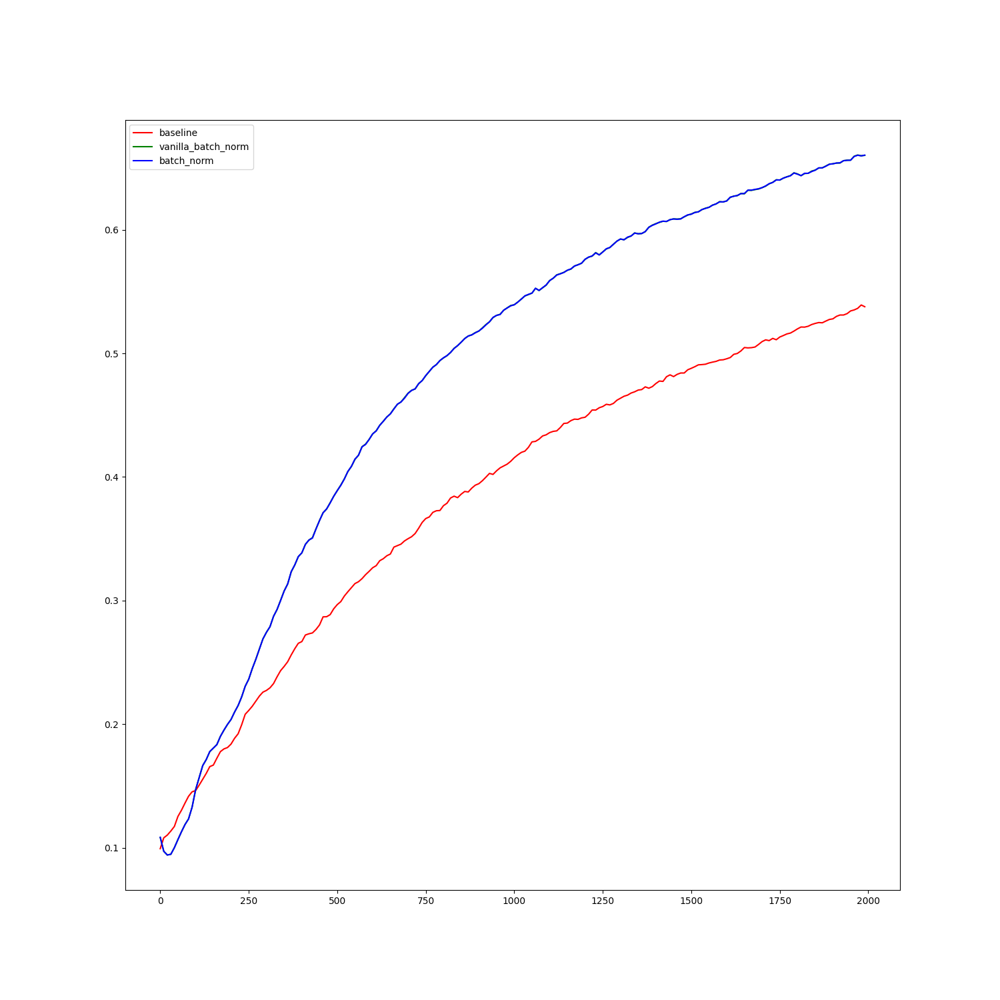

## What is this?

TLDR; Jax's vmap that forces you to think about map over the batch dimension would at first sight seem to run up against a wall when it comes to **Batch norm**.
The wall is an illusion. I was fooled. And here's my attempt to show that the wall isn't there


## Vmap, batch norm and more vamp

Jax is pretty sweet. It reeks of Haskell in a good way. It explicitly deals with what I call the "batch axis smell" i.e the batch axis stands out from the other axis and yet other frameworks expect you to treat it the same as the other axes.

What do I mean here? So assume we're solving the MNIST classification problem i.e given a black and white 28x28 image of a single digit, map it to a number from 0 to 9
It's a well defined problem.
Assume the neural net is a feed forward neural network which 3 hidden layers, 1 output layer. The hidden layer width is 100 i.e 100 activations per "weight-gap"

You have to write something that takes in a batch of images and pass it though this network. How do you proceed?

Important question: **At what stage do you think of the Batch Dimension?**

the JAX way: 

> the important step is figuring out how you'd want to deal with one image.
> Let the framework deal with the batch dimension. The framework's tool -> Vmap 

Here, look at the forward step and __look at the asserts__

```python

def forward_pass(nn: List[Float32[Array, "y x"]], image_vector: Float32[Array, "x"]) -> Float32[Array, "x"]:

    assert image_vector.ndim == 1 

    output = image_vector

    for i, lt in enumerate(nn):
        w = lt["weight"]

        output = output @ w
        if lt.get("bias", None) is not None:
            output += lt["bias"]

        if i < len(nn) - 1:
            output = jax.nn.sigmoid(output)

    assert output.ndim == 1 

    return output

```

and here's how the batch dimension is dealt with

```python

def cross_entropy_loss(params: NNParams , x: Float32[Array, "batch x"] , labels: Int32[Array, "batch z"]) -> Float32:

    logits = jax.vmap(forward_pass, in_axes=(None, 0))(params, x) # <- important bit
    # one-hot, this is batched
    logits = jax.nn.log_softmax(logits, axis=-1)
    loss = jax.vmap(operator.getitem, in_axes=(0, 0))(logits, labels)
    return -loss.mean()

```

During any trench run, Jax says "use the *vmap*, Luke!"


## Cool beans and possibly neat? How do you Batch norm if the batch axis is an explicit detail required for the forward pass computation

This is the illusionary wall. Bear with me


### Short pit stop: the Batch norm


So I have two implementations `vanilla_batch_norm` and  `batch_norm`

The first one doesn't use `vmap` for the forward pass and does it the normal way i.e the `forward_pass` utilizes the batch dimension

(Look at the asserts)

```python

def forward_pass(
    nn: common.NNParams,
    batch_norm_params: common.BatchParams,
    image_vector: Float32[Array, "batch x"],
) -> Tuple[Float32[Array, "batch classes"], Float32[Array, "z"], Float32[Array, "z"]]:

    assert image_vector.ndim == 2

    output = image_vector

    means_ = []
    vars_ = []

    for i, (lt, bn) in enumerate(itertools.zip_longest(nn, batch_norm_params)):
        w = lt["weight"]

        output = output @ w
        if lt.get("bias", None) is not None:
            output += lt["bias"]
        else:
            continue

        output, mean, var = activations_batch_normalization(output)

        means_.append(mean)
        vars_.append(var)

        if bn is not None:
            output = output * bn[:, 0][None, :] + bn[:, 1][None, :]

        if i < len(nn) - 1:
            output = jax.nn.sigmoid(output)

    assert output.ndim == 2

    return output, means_, vars_

```

so aside from the asserts, the activations_batch_normalization function here makes use of the fact that the activations are batched
and calculates the mean and variance of each activation across the batch dimension


```python

def activations_batch_normalization(
    activations: Float32[Array, "batch x"], eta: Float32 = 1e-6
) -> Tuple[Float32[Array, "batch x"], Float32[Array, "x"], Float32[Array, "x"]]:

    mean = activations.mean(axis=0)  # (B,K) -> (K)
    var = jnp.var(activations, axis=0, ddof=0)  # (B,K) -> (K,)
    x_i = (activations - mean[None, :]) / jnp.pow(var[None, :] + eta, 0.5)

    return x_i, mean, var

```


Boo and Booooo again. and boooo again. Why? we want the framework to take care of the  batch details

So Jax offers a way, specifically through a small piece in `vmap` called `axis_name` (and `output_axes`) and primitives in the `lax` submodules

that deals with pulling info from vmap as it's does it's magic working through the batch axis


```python

def activations_batch_normalization(
    activations: Float32[Array, "x"], axis: str, eta: Float32 = 1e-6
) -> Tuple[Float32[Array, "x"], Float32[Array, "x"], Float32[Array, "x"]]:
    mean = l.pmean(activations, axis_name=axis)
    sq_mean = jax.lax.pmean(activations**2, axis_name=axis)
    var = sq_mean - mean**2

    return ((activations - mean) / jnp.sqrt(var + eta)), mean, var

```

and

```python

def forward_pass(
    nn: common.NNParams,
    batch_norm_params: common.BatchParams,
    axis: str,
    image_vector: Float32[Array, "z"],
) -> Float32[Array, "classes"]:

    assert image_vector.ndim == 1

    output = image_vector

    means, variances = [], []

    for i, (lt, bn) in enumerate(itertools.zip_longest(nn, batch_norm_params)):
        w = lt["weight"]

        output = output @ w

        if i < len(nn) - 1:
            output += lt["bias"]

            x_i, mean, var = activations_batch_normalization(output, axis)

            means.append(mean)
            variances.append(var)

        if bn is not None:
            output = x_i * bn[:, 0] + bn[:, 1]

        if i < len(nn) - 1:
            output = jax.nn.sigmoid(output)

    assert output.ndim == 1

    # the means, variances collection effort is duplicated across batches

    return output, means, variances


```

The problem now is that the means and variances collection effort is duplicated across the batch dimension i.e each element of the batch pos out the same list of means and variances. There is a solution (spoiler alert `output_axes` keyword in vmap)


```python

def cross_entropy_loss(params, x, labels):

    axis = "batch"

    params, batch_norm_params = params
    logits, means, variances = jax.vmap(
        forward_pass,
        in_axes=(None, None, None, 0),
        out_axes=(0, None, None),   # <---- see here
        axis_name=axis,
    )(params, batch_norm_params, axis, x)

    logits = jax.nn.log_softmax(logits, axis=-1)
    loss = jax.vmap(operator.getitem, in_axes=(0, 0))(logits, labels)
    return -loss.mean(), (means, variances)

```

What it does is logits are kept per-example, and means/variances are returned once. You should try changing `out_axes=None` and see what happens


## How to run the code

```bash

pip install -e .

time python scripts/main.py

```

## Implementation output


